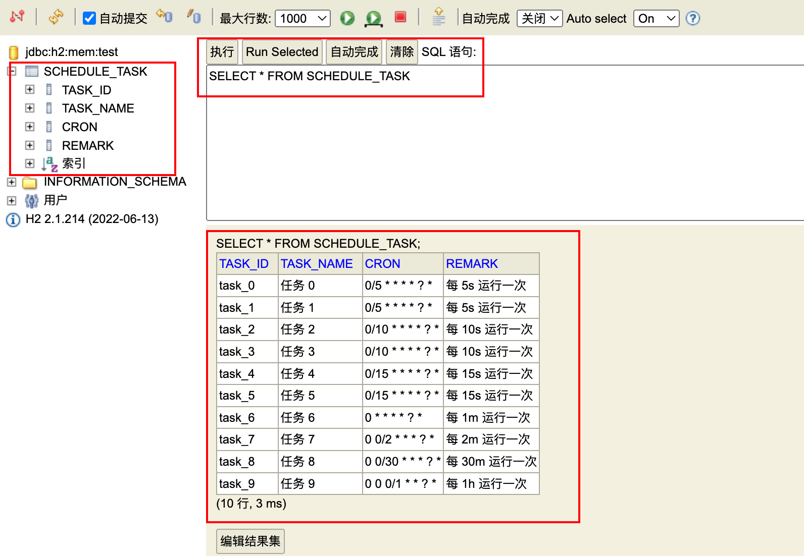

参考链接：[H2数据库入门 - 简书](https://www.jianshu.com/p/3663ef3fc93d)

# 一、简介

        H2 是一个Java编写的关系型数据库，它本身只是一个类库。可以被嵌入 Java 应用程序中使用，或者作为一个单独的数据库服务器运行。

用途：

1. 可以同应用程序打包在一次发布，可以非常方便地存储少量结构化数据；

2. 用于单元测试，启动速度快；可作为内存数据库，非持久化，每一个用例执行完随机还原到最初的状态；

3. 作为缓存，当做 NoSQL 的一个补充。当某些场景下数据模型必须为关系型，可以拿它当Memcached使，作为后端MySQL/Oracle的一个缓冲层，缓存一些不经常变化但需要频繁访问的数据，比如字典表、权限表。不过这样系统架构就会比较复杂了。

优势：

- 纯Java编写，不受平台的限制；
- 只有一个jar文件，适合作为嵌入式数据库使用；
- h2提供了一个十分方便的web控制台用于操作和管理数据库内容；
- 功能完整，支持标准SQL和JDBC。麻雀虽小五脏俱全；
- 支持内嵌模式、服务器模式和集群。

# 二、下载和安装

下载，H2数据库下载地址：[http://www.h2database.com/html/download.html](https://links.jianshu.com/go?to=http%3A%2F%2Fwww.h2database.com%2Fhtml%2Fdownload.html)。
解压缩后的目录结构：  
    h2  
    |---bin  
    |  |---h2-1.4.199.jar    // H2数据库的jar包（驱动也在里面）  
    |  |---h2.bat    // Windows控制台启动脚本  
    |  |---h2.sh    // Linux控制台启动脚本  
    |  |---h2w.bat    // Windows控制台启动脚本（不带黑屏窗口）  
    |---docs    // H2数据库的帮助文档（内有H2数据库的使用手册）  
    |---service    // 通过wrapper包装成服务。  
    |---src    // H2数据库的源代码  
    |---build.bat    // windows构建脚本  
    |---build.sh    // linux构建脚本  
  此时就算“安装”完成了。

# 三、运行模式和运行方式

## 运行模式：

H2 有三种运行模式

1. 内嵌模式（Embedded Mode）
   
   内嵌模式下，应用和数据库同在一个JVM中，通过JDBC进行连接。可持久化，但同时只能一个客户端连接。内嵌模式性能会比较好。

2. 服务器模式（Server Mode）
   
   使用服务器模式和内嵌模式一样，只不过它可以跑在另一个进程或另一个服务器里。

3. 混合模式
   
   第一个应用以内嵌模式启动它，对于后面的应用来说它是服务器模式跑着的。混合模式是内嵌模式和服务器模式的组合。第一个应用通过内嵌模式与数据库建立连接，同时也作为一个服务器启动，于是另外的应用（运行在不同的进程或是虚拟机上）可以同时访问同样的数据。第一个应用的本地连接与嵌入式模式的连接性能一样的快，而其它连接理论上会略慢。

## 运行方式

1. 嵌入式连接方式（Embedded）
   
   这种连接方式默认情况下只允许有一个客户端连接到H2数据库，有客户端连接到H2数据库之后，此时数据库文件就会被锁定，那么其他客户端就无法再连接了。
   
   连接语法：
   
   jdbc:h2:!(mem:)!(tcp://)[file:]{path:h2_db_file}[;<;,user={user:param},password={password:param},MV_STORE={MV_STORE:#param},{:identifier}={:param}>]
   
   例如：
       jdbc:h2:~/test    // 连接位于用户目录下的test数据库  
       jdbc:h2:file:/data/sample  
       jdbc:h2:file:E:/H2/gacl(Windows only)

2. 内存连接方式（In-memory）
   
   在内存中创建数据库和表，一旦服务器或程序重启，内存中的数据库和表就随着被清除了。
   
   连接语法：jdbc:h2:mem:{database::default}?[;<;,{:identifier}={:param}>]

3. TCP/IP 的服务器模式(远程连接)方式（Remote）
   
   这种连接方式就和其他数据库类似了，是基于Service的形式进行连接的，因此允许多个客户端同时连接到H2数据库。
   
   连接语法：
   
   jdbc:h2:tcp://{host::localhost}[:{port::9092}]/{database::default}[;<;,user={user:param},password={password:param},{:identifier}={:param}>]
   
     范例：jdbc:h2:tcp://localhost/~/test

## 连接语法说明：

jdbc:h2:!(mem:)!(tcp://)[file:]{path:h2_db_file}[;<;,user={user:param},password={password:param},MV_STORE={MV_STORE:#param},{:identifier}={:param}>]

- jdbc:h2 表示使用 h2 数据库

- mem 表示内存数据库；file 表示文件型数据库；tcp 表示远程连接型数据库

参数说明：

> MODE=MySQL

创建的数据库使用 MySQL 兼容模式，这样如果需要将数据局迁移到服务器上的 MySQL 数据库时就，就不用对逻辑代码和实体进行修改。

> DB_CLOSE_DELAY=-1

默认情况下，H2 会在最后的连接断开时关闭数据库。针对内存数据库来说，如果这时候再发起连接请求，很有可能程序会得到连接丢失的错误。如果使用了连接池，通常在 JVM 退出之前，连接池都会保持有数据库连接，所以这个问题针对使用连接池的情况可能不存在。

如果没有使用连接池，建议加上该配置，保证在 JVM 退出之前 H2 数据库不会关闭连接。

> DB_CLOSE_ON_EXIT=FALSE

默认值为 TRUE

默认情况下，H2 在最后的连接退出后关闭数据库。如果这种情况下没有被关闭的话，那么将会在 JVM 退出的时候关闭数据库。

如果不希望 JVM 退出的时候就关闭数据库，比如说需要写入一些虚拟机的关闭过程等，那这时就需要将该参数配置为 TRUE。

> INIT=RUNSCRIPT FROM 'classpath:H2.sql'

初始化 SQL 脚本，classpath 指的是当前项目的 resources 目录

这样在内存数据库初始化完成后，会执行该脚本文件去创建表和插入一些数据

> AUTO_SERVER=TRUE

允许多进程访问数据库，FALSE 的时候，如果有两个进程同时访问数据库，将会得到数据库文件被占用的错误。

# 四、代码示例

Sprint Boot 结构示例


1. Maven 引入依赖

```xml
    <dependencies>
        <dependency>
            <groupId>org.springframework.boot</groupId>
            <artifactId>spring-boot-starter-web</artifactId>
        </dependency>
        <dependency>
            <groupId>org.springframework.boot</groupId>
            <artifactId>spring-boot-starter-data-jpa</artifactId>
        </dependency>
        <dependency>
            <groupId>org.springframework.boot</groupId>
            <artifactId>spring-boot-starter-test</artifactId>
        </dependency>
        <dependency>
            <groupId>org.projectlombok</groupId>
            <artifactId>lombok</artifactId>
        </dependency>
        <dependency>
            <groupId>com.h2database</groupId>
            <artifactId>h2</artifactId>
        </dependency>
    </dependencies>
```

2. yml 文件配置

```yml
server:
  port: 8081
spring:
  datasource:
    url: jdbc:h2:mem:test; # INIT=RUNSCRIPT FROM 'classpath:/db/H2.sql'
    driver-class-name: org.h2.Driver
    username: sa
    password:
  jpa:
    database: H2
    show-sql: true
    hibernate:
      ddl-auto: none # 当使用嵌入式数据库且没有检测到 schema 管理器时，默认是 "create-drop" 模式，其他默认是 none
                     # 如果用的 sql.init.schema-locations 和 data-locations 去初始化数据库，就没有上面所说的有 schema 管理器，
                     # 所以这里必须设置为 none，否则当 sql.init 执行完成后，它的 "create-drop" 将会把表干掉重建，数据就丢失了
                     # 如果是在 jdbc:h2:mem:test; 后面加了 INIT=RUNSCRIPT FROM 'classpath:/db/H2.sql'，则这里可以忽略，
                     # 虽然还是 "create-drop"，但好在 runscript 晚执行，数据是后续才添加进来了
  h2:
    console:
      enabled: true # 开启控制台，访问路径格式如：http://localhost:8081/h2-console
  sql:
    init:
      mode: embedded
      schema-locations: classpath:/db/schema.sql
      data-locations: classpath:/db/data.sql
```

3. 代码

ScheduleTask 实体类代码通过 @Entity 注解，实现对象关系映射

```java
package top.linhx.h2.entity;

import lombok.*;
import org.hibernate.Hibernate;

import javax.persistence.Entity;
import javax.persistence.Id;
import java.util.Objects;

@Getter
@Setter
@ToString
@AllArgsConstructor
@NoArgsConstructor
@Entity
public class ScheduleTask {
    @Id
    private String taskId;
    private String taskName;
    private String cron;
    private String remark;

    @Override
    public boolean equals(Object o) {
        if (this == o) return true;
        if (o == null || Hibernate.getClass(this) != Hibernate.getClass(o)) return false;
        ScheduleTask that = (ScheduleTask) o;
        return taskId != null && Objects.equals(taskId, that.taskId);
    }

    @Override
    public int hashCode() {
        return getClass().hashCode();
    }
}
```

dao 接口代码通过继承 Jpa 接口，实现了对应的 crud 操作

```java
@Repository
public interface H2Repository extends JpaRepository<ScheduleTask, String> {

}
```

服务层的代码比较简单，基本就是调用下 dao 层代码而已

```java
public interface H2Service {
    List<ScheduleTask> getTask(int pageNum, int pageSize);

    ScheduleTask getTaskById(String id);

    ScheduleTask addTask(ScheduleTask task);

    void updateTask(ScheduleTask task);

    void delTaskById(String id);
}
```

```java
@Service
public class H2ServiceImpl implements H2Service {

    @Autowired
    private H2Repository h2Repository;

    @Override
    public List<ScheduleTask> getTask(int pageNum, int pageSize) {
        PageRequest pageRequest = PageRequest.of(pageNum, pageSize);
        Page<ScheduleTask> taskPage = h2Repository.findAll(pageRequest);
        return taskPage.getContent();
    }

    @Override
    public ScheduleTask getTaskById(String id) {
        return h2Repository.findById(id).orElse(null);
    }

    @Override
    public ScheduleTask addTask(ScheduleTask task) {
        return h2Repository.save(task);
    }

    @Override
    public void updateTask(ScheduleTask task) {
        h2Repository.save(task);
    }

    @Override
    public void delTaskById(String id) {
        h2Repository.deleteById(id);
    }
}
```

测试用例代码：

```java
@SpringBootTest
public class H2Test {

    @Autowired
    private H2Service h2Service;

    @Autowired
    private H2Repository h2Repository;

    @Test
    public void addTask() {
        ScheduleTask newTask = new ScheduleTask();
        newTask.setTaskId("task_new");
        newTask.setTaskName("newTaskName");
        newTask.setCron("* * * * * * ?");
        newTask.setRemark("remark");
        ScheduleTask scheduleTask = h2Service.addTask(newTask);
        System.out.println(scheduleTask);
    }

    @Test
    public void getTaskPage() {
        List<ScheduleTask> tasks = h2Service.getTask(0, 15);
        tasks.forEach(System.out::println);
    }

    @Test
    public void getTask() {
        ScheduleTask task_8 = h2Service.getTaskById("task_8");
        System.out.println(task_8);
    }

    @Test
    public void updateTask() {
        String taskId = "task_1";
        ScheduleTask task_1 = h2Service.getTaskById(taskId);
        System.out.println("before update -> " + task_1);

        String taskName = task_1.getTaskName() + "_new";
        task_1.setTaskName(taskName);
        h2Service.updateTask(task_1);

        task_1 = h2Service.getTaskById(taskId);
        System.out.println("after update -> " + task_1);
    }

    @Test
    public void delTask() {
        String taskId = "task_1";
        System.out.println(taskId + "exist " + h2Repository.existsById(taskId));
        h2Service.delTaskById("task_1");
        System.out.println("after del : " + taskId + "exist " + h2Repository.existsById(taskId));
    }
}
```

数据脚本：

我们可以在配置 H2 数据库地址的时候，加上参数 `INIT=RUNSCRIPT FROM 'classpath:H2.sql'`来执行数据库表的初始化，也可以通过 sql.init 来进行初始化。

```yml
spring:
  sql:
    init:
      mode: embedded
      schema-locations: classpath:/db/schema.sql
      data-locations: classpath:/db/data.sql
```

H2.sql 内容如下，如果用 sql.init 来初始化，即 schema.sql 存放建表的部分，而 data.sql 存放数据部分

```sql
CREATE TABLE if not exists schedule_task
(
    task_id   varchar(20) PRIMARY KEY,
    task_name varchar(20),
    cron      varchar(40),
    remark    varchar(100)
);


insert into schedule_task
values ('task_0', '任务 0', '0/5 * * * * ? *', '每 5s 运行一次'),
       ('task_1', '任务 1', '0/5 * * * * ? *', '每 5s 运行一次'),
       ('task_2', '任务 2', '0/10 * * * * ? *', '每 10s 运行一次'),
       ('task_3', '任务 3', '0/10 * * * * ? *', '每 10s 运行一次'),
       ('task_4', '任务 4', '0/15 * * * * ? *', '每 15s 运行一次'),
       ('task_5', '任务 5', '0/15 * * * * ? *', '每 15s 运行一次'),
       ('task_6', '任务 6', '0 * * * * ? *', '每 1m 运行一次'),
       ('task_7', '任务 7', '0 0/2 * * * ? *', '每 2m 运行一次'),
       ('task_8', '任务 8', '0 0/30 * * * ? *', '每 30m 运行一次'),
       ('task_9', '任务 9', '0 0 0/1 * * ? *', '每 1h 运行一次');
```


# 五、控制台

H2 数据库可以通过控制台访问，能更直观地看到库表数据

需要修改配置值 spring:h2:console:enabled: true 开启

访问地址：[http://localhost:8081/h2-console]()



